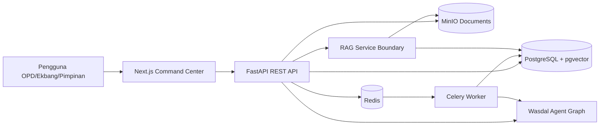
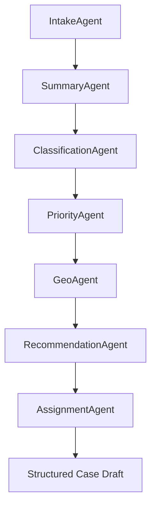

# Arsitektur Wasdal

Wasdal memakai clean architecture berbasis boundary yang jelas:

- Frontend hanya berkomunikasi dengan REST API.
- Backend menjadi application layer untuk kasus, audit, dashboard, meeting, knowledge base, dan auth.
- Agents berdiri sebagai domain AI orchestration yang dapat dipanggil sync oleh API atau async oleh worker.
- RAG dipisahkan dari backend agar ingestion, embedding, pgvector, dan retrieval dapat diskalakan mandiri.
- Shared menyimpan aturan domain yang perlu konsisten di semua service.

## Agent Graph

Semua output AI menyertakan confidence score dan audit notes. AI tidak menghapus data, tidak menutup kasus, tidak menyetujui anggaran, tidak mengambil keputusan hukum, dan tidak mengubah kewenangan.

## RBAC

Role awal:

- Administrator
- Bagian Ekbang
- Sekretariat
- Perangkat Daerah
- Kecamatan
- Kelurahan
- Surveyor Lapangan
- Pimpinan
- Guest

Endpoint saat ini membuka sebagian operasi untuk demo lokal. `require_roles()` sudah tersedia untuk mengunci endpoint ketika kebijakan final disepakati.
