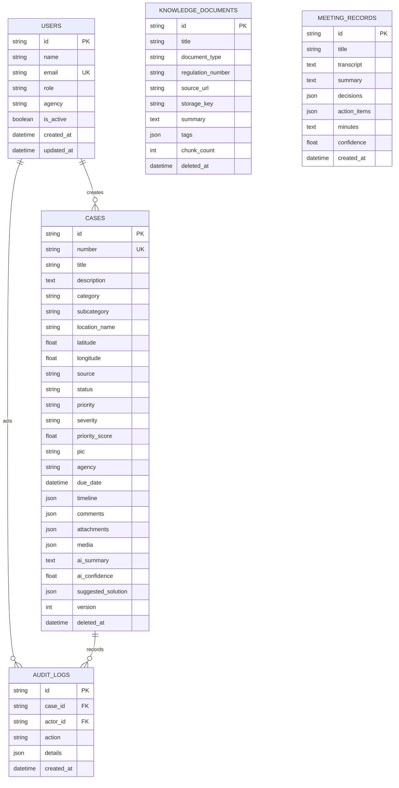

# ERD

```mermaid
erDiagram
  USERS ||--o{ CASES : creates
  USERS ||--o{ AUDIT_LOGS : acts
  CASES ||--o{ AUDIT_LOGS : records

  USERS {
    string id PK
    string name
    string email UK
    string role
    string agency
    boolean is_active
    datetime created_at
    datetime updated_at
  }

  CASES {
    string id PK
    string number UK
    string title
    text description
    string category
    string subcategory
    string location_name
    float latitude
    float longitude
    string source
    string status
    string priority
    string severity
    float priority_score
    string pic
    string agency
    datetime due_date
    json timeline
    json comments
    json attachments
    json media
    text ai_summary
    float ai_confidence
    json suggested_solution
    int version
    datetime deleted_at
  }

  AUDIT_LOGS {
    string id PK
    string case_id FK
    string actor_id FK
    string action
    json details
    datetime created_at
  }

  KNOWLEDGE_DOCUMENTS {
    string id PK
    string title
    string document_type
    string regulation_number
    string source_url
    string storage_key
    text summary
    json tags
    int chunk_count
    datetime deleted_at
  }

  MEETING_RECORDS {
    string id PK
    string title
    text transcript
    text summary
    json decisions
    json action_items
    text minutes
    float confidence
    datetime created_at
  }
```
